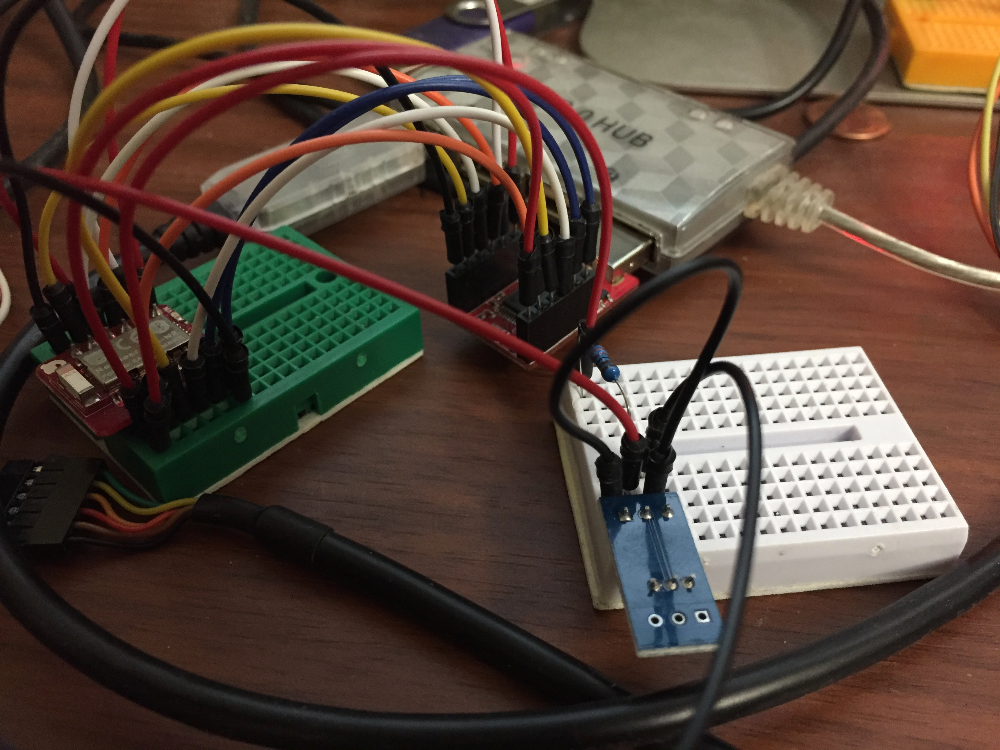

# nRF5x DS18B20 example

### Description

Short example broadcasting a DS18B20 temperature sensor over Bluetooth LE

### Electrical

DS18B20 wired in parasitic mode.  3.3V -> 2.2kΩ resistor -> DQ, DQ -> D4 (nRF).  VCC shorted to GND.

### Current consumption

Typical with no calls into mbed SDK is about 8mA.

Turning on DCDC in loop brings it down to 3.5mA.

Calling sd_app_evt_wait brings it down to 0.36mA on system boot.

Back to 3.5mA once a central connects.  Force a system reset when a central disconnects brings it back down to 0.36mA.
